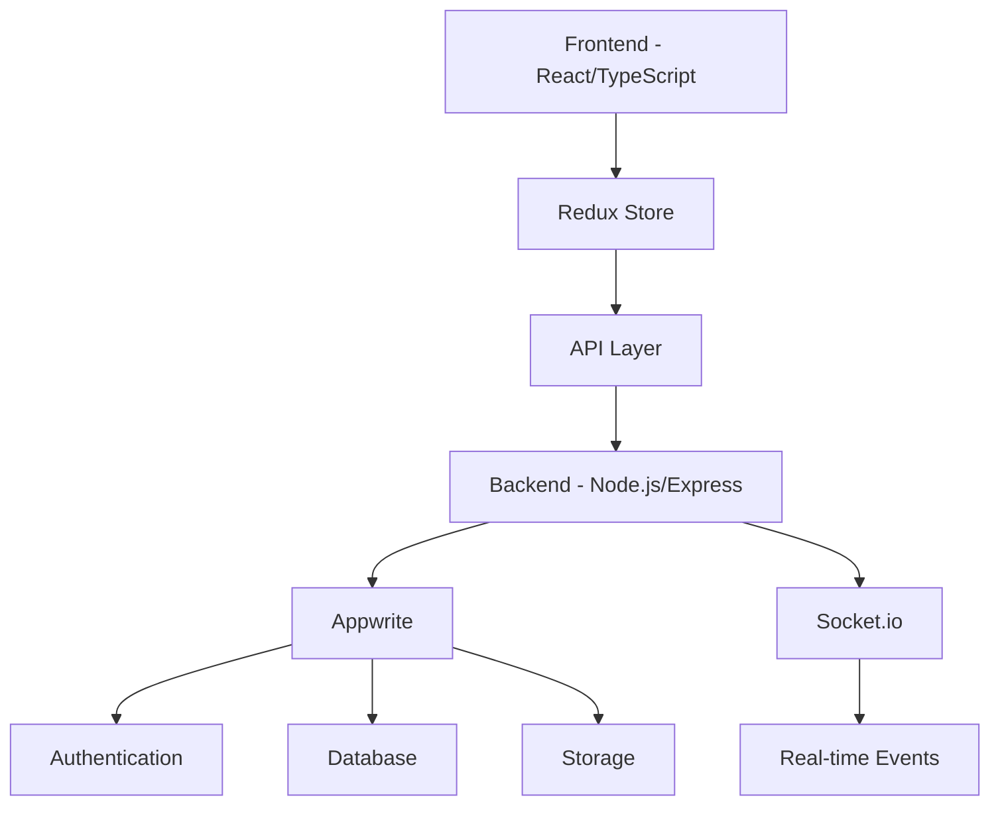

# 🚀 Remote Team Hub

<div align="center">
  
  
  <h3>A Modern Platform for Remote Team Collaboration</h3>

  <p>
    <a href="#features">Features</a> •
    <a href="#tech-stack">Tech Stack</a> •
    <a href="#getting-started">Getting Started</a> •
    <a href="#architecture">Architecture</a> •
    <a href="#contributing">Contributing</a>
  </p>
</div>

## ✨ Features

<div align="center">
  <table>
    <tr>
      <td align="center">
        
        <br />
        <b>Real-time Chat</b>
      </td>
      <td align="center">
        
        <br />
        <b>Task Management</b>
      </td>
      <td align="center">
        
        <br />
        <b>Video Calls</b>
      </td>
    </tr>
  </table>
</div>

### 🎯 Core Features

- **📱 Responsive Design**

  - Seamless experience across all devices
  - Beautiful animations and transitions
  - Modern, clean interface

- **💬 Real-time Communication**

  - Instant messaging with typing indicators
  - File sharing and emoji support
  - Thread discussions and mentions

- **📋 Task Management**

  - Kanban board with drag-and-drop
  - Task assignments and due dates
  - Priority levels and status tracking

- **🎥 Video Conferencing**

  - HD video calls with screen sharing
  - Meeting scheduling and reminders
  - Recording capabilities

- **🔒 Security**
  - End-to-end encryption
  - Two-factor authentication
  - Role-based access control

## 🛠️ Tech Stack

<div align="center">

[](https://reactjs.org/)
[](https://www.typescriptlang.org/)
[](https://redux.js.org/)
[](https://tailwindcss.com/)
[](https://nodejs.org/)
[](https://expressjs.com/)
[](https://socket.io/)
[](https://appwrite.io/)

</div>

## 🚀 Getting Started

1. **Clone the repository**

   ```bash
   git clone https://github.com/tarunerror/remote-team-hub.git
   cd remote-team-hub
   ```

2. **Install dependencies**

   ```bash
   # Install frontend dependencies
   npm install

   # Install backend dependencies
   cd backend
   npm install
   ```

3. **Set up environment variables**

   ```bash
   # Frontend (.env)
   VITE_API_URL=http://localhost:5000
   VITE_APPWRITE_ENDPOINT=your_appwrite_endpoint
   VITE_APPWRITE_PROJECT_ID=your_project_id
   VITE_AGORA_APP_ID=your_agora_app_id

   # Backend (.env)
   PORT=5000
   NODE_ENV=development
   JWT_SECRET=your_jwt_secret
   APPWRITE_ENDPOINT=your_appwrite_endpoint
   APPWRITE_PROJECT_ID=your_project_id
   APPWRITE_API_KEY=your_api_key
   ```

4. **Start the development servers**

   ```bash
   # Start backend server
   cd backend
   npm run dev

   # Start frontend server (in a new terminal)
   cd frontend
   npm run dev
   ```

## 🏗️ Architecture



## 🤝 Contributing

1. Fork the repository
2. Create your feature branch (`git checkout -b feature/amazing-feature`)
3. Commit your changes (`git commit -m 'Add some amazing feature'`)
4. Push to the branch (`git push origin feature/amazing-feature`)
5. Open a Pull Request

## 🙏 Acknowledgments

- [React](https://reactjs.org/) - Frontend library
- [Tailwind CSS](https://tailwindcss.com/) - Styling
- [Appwrite](https://appwrite.io/) - Backend as a Service
- [Socket.io](https://socket.io/) - Real-time communication
- [Lucide Icons](https://lucide.dev/) - Beautiful icons

---

<div align="center">
  <sub>Built with ❤️ by Tarun Gautam</sub>
</div>
